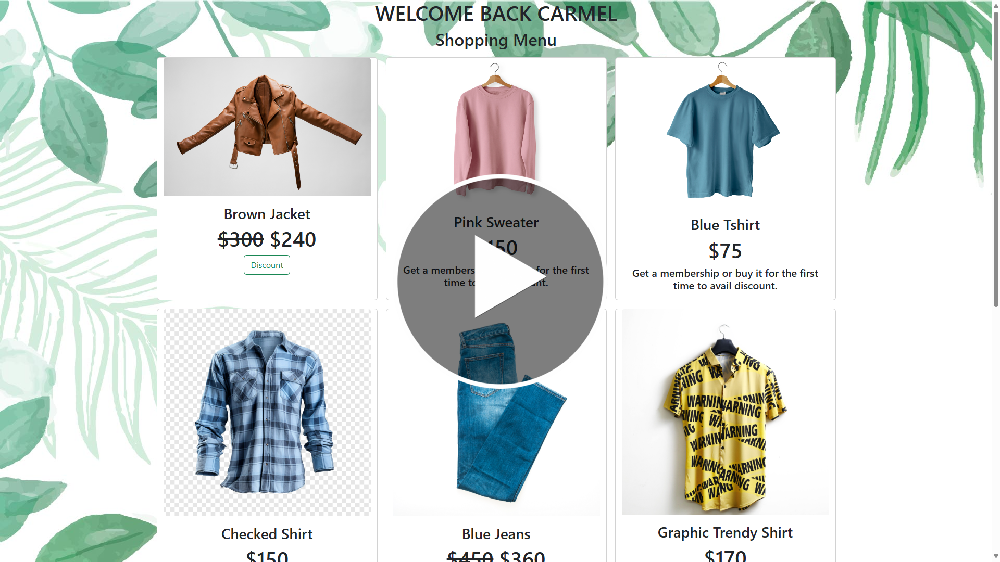

<h1 align="center">Discount Access Manager 🤑</h1>
<h3 align="center">Manage discounts based on the user's membership and purchase history.</h3>

> [!IMPORTANT]
> Alternatively you can refer to this link: https://youtu.be/7uHPNM5C3V8?si=8xy3Kb4zewR5Iyk6

 

# Discount Corner
**This web application uses OPAL's policy authentication and authorization feature to let users access discounts based on their membership and purchase history.
It uses git webhook to deliver the payload to the OPAL server, which changes the website's discounted items dynamically.**

 

## Features
- Classification and authentication using user's data.
- User's membership and purchase history authorizes him/her to specific discounts.
  - Membership holders will get a full discount on all the items on the website.
  - Users without membership will get discounts based on their purchase history.
- Uses git webhook to track committed changes in the policy repo.
