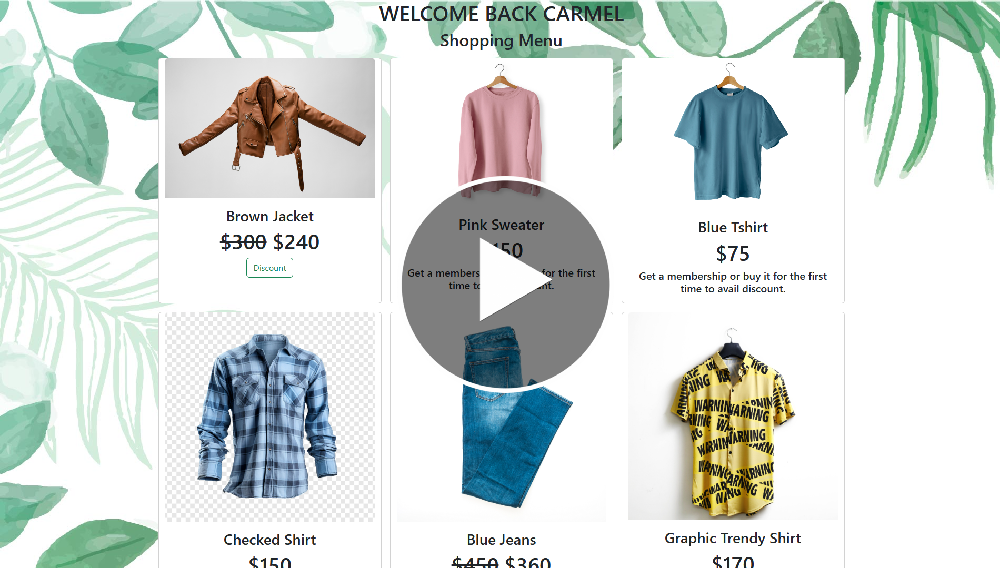
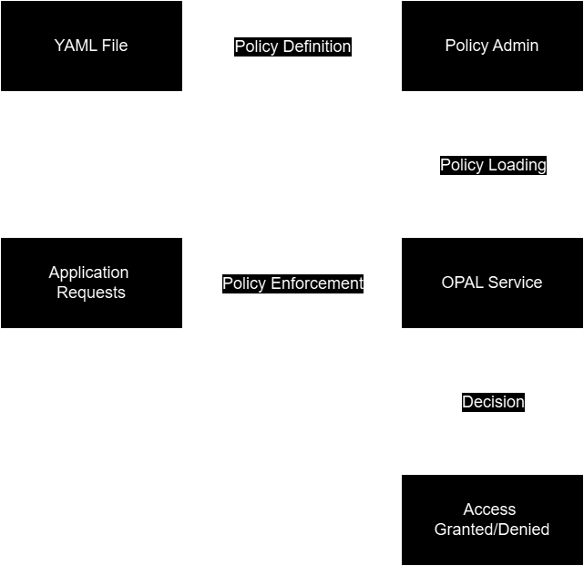
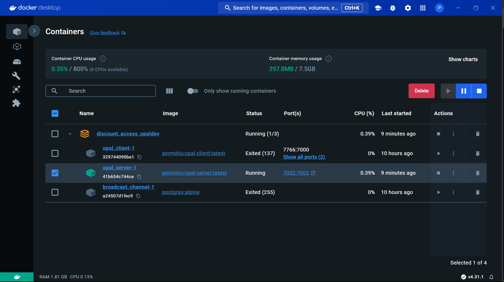
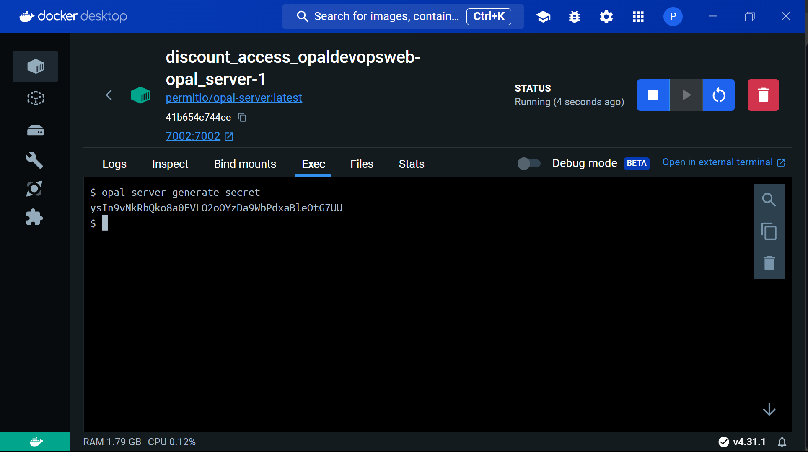
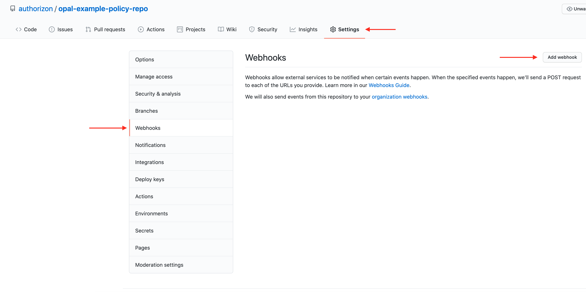
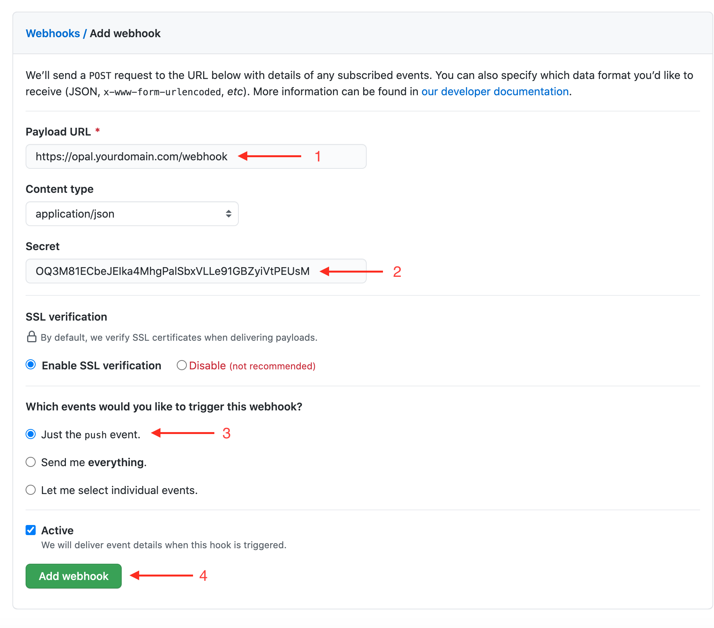

<h1 align="center">Discount Access Manager 🤑</h1>
<h3 align="center">Manage discounts based on the user's membership and purchase history.</h3>

<a href="https://www.youtube.com/watch?v=7uHPNM5C3V8"><kbd></kbd></kbd></a>

> [!IMPORTANT]
> Alternatively you can refer to this link: https://youtu.be/7uHPNM5C3V8?si=8xy3Kb4zewR5Iyk6

<br>

# Discount Corner
**This web application uses OPAL's policy authentication and authorization feature to let users access discounts based on their membership and purchase history.
It uses git webhook to deliver payloads to the OPAL server, which changes website's discounted items dynamically.**

## Features
- Classification and authentication using user's data.
- User's membership and purchase history authorizes him/her to specific discounts.
  - Membership holders will get a full discount on all the items on the website.
  - Users without membership will get discounts based on their purchase history.
- Uses git webhook to track committed changes in the policy repo.

<br>

# Policy Management Flow


<br>

# Synchronization Workflow


<br>

# :outbox_tray: Installation Guide
These are the steps required to install and run the Discount Access Manager 🤑 project:

1. Clone the repository and change the current directory to the cloned repository:
```bash
  git clone https://github.com/piyushk2001/Discount-Access-Manager.git
  cd Discount-Access-Manager
```

2. Run the docker-compose.yml: *(If you have Docker Hub installed, KUDOS!)*
```docker
  docker compose up
```

3. For policy-making changes, fork `https://github.com/piyushk2001/Discount_Access_PolicyOPAL.git` and pass it to `OPAL_POLICY_REPO_URL` in the opal-server environment inside `docker-compose.yml`.

4. Head over to the running opal-server container in Docker Hub and generate a webhook secret key using its **Exec CL:** `opal-server generate-secret` and pass it to `OPAL_POLICY_REPO_WEBHOOK_SECRET` in the opal-server environment inside `docker-compose.yml`.

<br>

&nbsp;&nbsp;&nbsp;&nbsp;&nbsp;

5. Visit Ngrok for your auth token and run the following command CMD (admin-mode):
```cmd
  choco install ngrok
  ngrok config add-authtoken YOUR_AUTH_TOKEN
  ngrok http http://localhost:7002
```

6. Add Ngrok's mapped public URL and secret key to your GitHub's policy repo webhook.

<br>

&nbsp;&nbsp;&nbsp;&nbsp;&nbsp;

7. Setup and run your project: *(use any code editor terminal like VS Code or CLI in the current directory)*
```bash
  npm i express axios ejs
  npm i -g nodemon
  nodemon index.js
```

> [!NOTE]
> `nodemon index.js` will start the server at `http://localhost:3000` and reflect any code changes dynamically.

<br>

<p align="center">
   Thank you for visiting and if you liked it... <br> <a href="https://github.com/piyushk2001/Discount-Access-Manager/stargazers">...give this repo a ⭐</a>
</p>
